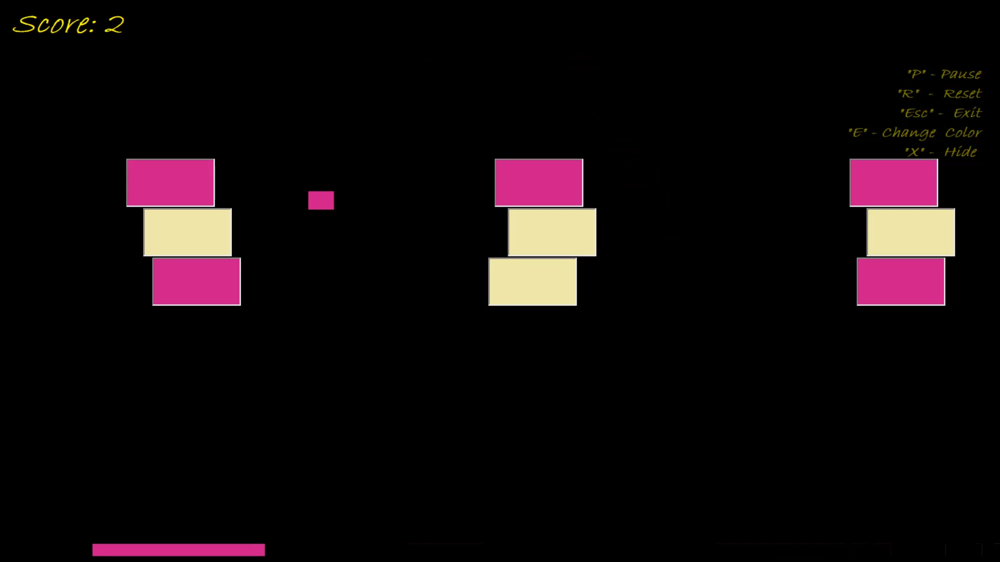
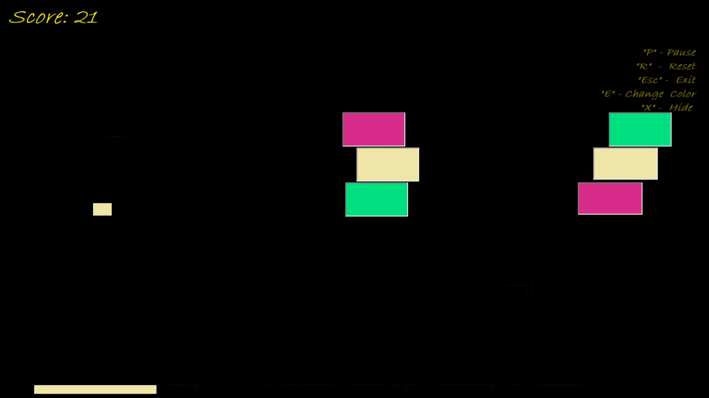
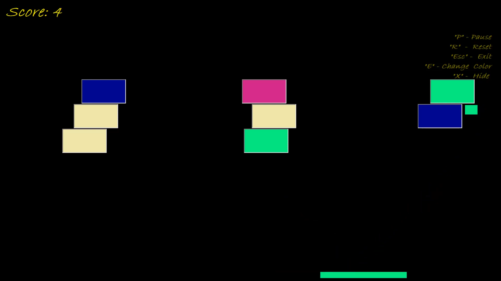

# `BBC Switch`  проект по предметот [визуелно програмирање](https://github.com/finki-mk/VP)

## изработил: ``Филип Цоњковски`` индекс: ``151227``

### Инспирација

Во оваа проектна задача изработив игра чии функционалности се инспирирани од игрите [Brick breaker](https://en.wikipedia.org/wiki/Brick_Breaker) и [Color Switch](https://color-switch.fandom.com/wiki/Color_Switch).
### Упатство за играње и корисничко сценарио
Играчот користи рекет кој треба да ја погоди топката (коцка) со која ги крши циглите (правоаголници), освен што корисникот треба да ја погоди топката тој треба и да ја изедначи бојата на рекетот со бојата на топката. 
###
циглите генерираат боја по случаен избор стандардно се генерира 3х3 цигли  и редови.

#### топката ја менува бојата во два случаи:
 - по случаен избор при удар со рекетот.
 - доколку погоди цигла  со различна боја од топката,ја превзема бојата од циглата.
####
Одкако ќе се скрши цигла по 2 секунди се генерира нова цигла на истата локација на y оската , но се менува локацијата по случаен избор по х оската во зададен опсег.
#### поени
- доколку циглата и топката се иста боја играчот добива 3 поени и циглата се уништува.
- доколку топката ја погоди циглата од различна боја не се добиваат поени и топката се одбива од циглата. 
- доколку рекетот ја погоди топката и се иста боја играчот добива 1 поен.

#### целта на играта е да се соберат што повеќе поени.
### крај на игра
- играта завршува кога топката ќе падне на земја.
- играта завршува кога играчот ќе ја удри топката со рекет од  различна боја.
#### команди во играта:
- Копчето `E`служи за менување на боите во редослед.
- Копчето `P` служи за паузирање на  играта 
( но само кога топката се наоѓа во горната половина од екранот со цел да се спречи мамење )
- Копчето `R` служи за рестартирање на играта.
- Копчето `Esc` служи за излез од играта.
- Копчето `X` служи за прикажување и сокривање на описот на  команди во играта.


### Gameplay и слики од играта
[](https://www.youtube.com/watch?v=UKuxPG8mccg "BBC Switch Gameplay")
### gameplay video
####



### Детали за решението
Kористени компоненти label, richbox, timer, panel, pictureboxes.
###
локација на играта [/PongGame2/Form1.cs](https://github.com/no-ctrl/BBC-Switch-VP-Project/blob/master/PongGame2/Form1.cs)

- почетните цигли   ги генерирам преку функцијата 
```void generateBlocks() ```која се започнува на ````111-та линија```` каде што пополнувам Picturebox матрица и ги додавам на екранот.
- новите цигли ги креирам преку  функцијата ````Task generateNewBlock(int top, int left)```` која започнува на ```` 92-та линија ````
```csharp

private async  Task  generateNewBlock(int top, int left)
        {
            int height = 70;
            int width = 140;
            PictureBox block = new PictureBox();
            block.Tag = "blocks";
            
            block.BorderStyle = BorderStyle.Fixed3D;
            block.BackColor = colors[random.Next(0, colors.Length)];
            block.Height = height;
            block.Width = width;
            block.Top = top;
            block.Left = left+random.Next(-120,70);
            await Task.Delay(2000);
            this.Controls.Add(block);
            block.BringToFront();
           
        } 
   
   ``` 

сетира висина,должина, креира цигла објект од picturebox, се доделува таг,боја по случаен избор и после две секунди од повикувањето се додаваат на екранот, додавањето е на локација како претходната уништена цигла по y оска но х оската е различна генерирана случајно во зададен ранг.
- на ````138-та линија```` се наоѓа функција која слуши за апликацијата да работи во full screen, без курсор, максимизирано.
- додека пак на ```153-та линија``` ```void setup()``` кој се повикува во конструкторот, служи за сетирање на почетните вредности на компонентите како топката,рекетот,лабелите и локациите.
- од ```291-та линија``` се сетирани копчињата од командите во играта набројани погоре. 
- oд `255-та линија` се  наоѓа  функцијата ```Task gameOver()``` која се повикува одкако играта ќе заврши и прикажува richboх со можни команди и остварен резултат.
- од `179-та линија` методот `void igra()` се наоѓа сета логика на играта,
како физиката на играта,пресметка  на поени,кога завршува  играта.
##### имплементирани звуци во играта:
- започнување на игра
- завршување на игра
- удар на топката во рекетот
- скршена цигла
- одбиена топка од цигла со различна боја


 ##### [Доколку имате прашања  filip.conjkovski[at]students.finki.ukim.mk](mailto:filip.conjkovski@students.finki.ukim.mk) 
